# Serverless IoT Sensor Analytics on AWS

This project demonstrates a simple serverless cloud application on **AWS** that simulates IoT sensor data, ingests it securely, performs real-time analytics, and displays the results on a web dashboard.  
It integrates core cloud concepts such as **serverless architecture, IoT communication, and data handling**.

---

## Features

- **Simulated IoT Sensors**: Python script simulates temperature & humidity sensors generating data streams.  
- **Secure Data Ingestion**: MQTT protocol with certificate-based authentication via AWS IoT Core.  
- **Serverless Data Processing**: AWS Lambda functions for ingestion and analytics.  
- **Persistent Storage**: Amazon DynamoDB stores raw readings and analytics results.  
- **Scheduled Analytics**: EventBridge (CloudWatch Events) triggers periodic analytics (Avg, Min, Max).  
- **Real-time Dashboard**: HTML/JS dashboard fetches sensor data via API Gateway and updates automatically.  

---

## 🛠 Technology Stack

- **Cloud Provider**: AWS  
- **IoT**: AWS IoT Core (MQTT Broker, Rules Engine, Device Management)  
- **Compute**: AWS Lambda (Python 3.x)  
- **Database**: Amazon DynamoDB (NoSQL)  
- **API**: Amazon API Gateway (REST)  
- **Orchestration**: Amazon EventBridge (CloudWatch Scheduled Events)  
- **Languages/SDKs**: Python 3.x, Boto3, AWSIoTPythonSDK, HTML, JavaScript  

---

## 📋 Prerequisites

Before starting, ensure you have:

- An active **AWS Account** with permissions for IoT Core, Lambda, DynamoDB, API Gateway, EventBridge, IAM.  
- **AWS Credentials** configured (`AWS_ACCESS_KEY_ID`, `AWS_SECRET_ACCESS_KEY`, `AWS_REGION`) via environment variables or `~/.aws/credentials`.  
- **Python 3.x** and **pip** installed locally.  
- **Git** installed.  
- **AWS IoT Certificates** (Thing, certificate, private key, root CA).  
  > ⚠️ These files are sensitive — **do not commit them** to GitHub.  

---

## ⚙️ Setup & Installation

### 1. Clone Repository
```bash
git clone https://github.com/ananya101001/aws-iot-dashboard
cd aws-iot-dashboard
pip install AWSIoTPythonSDK boto3

```

## 2. Create AWS Resources

### 🗄 DynamoDB Tables
- **RawSensorData**  
  - Partition Key: `deviceID` (String)  
  - Sort Key: `timestamp` (Number)  

- **SensorAnalytics**  
  - Partition Key: `sensorType` (String)  

---

### 📡 IoT Core
1. Create a Thing (e.g., `MySimulatedDevice`).  
2. Create and download certificates (`.crt`, `.key`, `.pem`).  
3. Create an IoT Policy (`MyDevicePolicy`) with permissions:  
   - `iot:Connect`  
   - `iot:Publish` (topic: `sensors/data`)  
4. Attach the policy to the certificate.  
5. Note your **IoT Core Endpoint**.  

---

### 📜 IoT Rule
- **Rule Name**: `StoreSensorDataRule`  
- **Query**:  
  ```sql
  SELECT * FROM 'sensors/data'

### Architecture Diagram 

```mermaid
flowchart LR
    A[Simulated IoT Sensors] -->|MQTT over TLS| B[AWS IoT Core]
    B -->|IoT Rule| C[DynamoDB: RawSensorData]
    B -->|IoT Rule → Lambda| D[Lambda: Calculate Analytics]
    D --> E[DynamoDB: SensorAnalytics]
    F[EventBridge - 1 min schedule] --> D
    G[Lambda: Get Dashboard Data] --> H[API Gateway]
    H --> I[Web Dashboard - HTML/JS]
```



